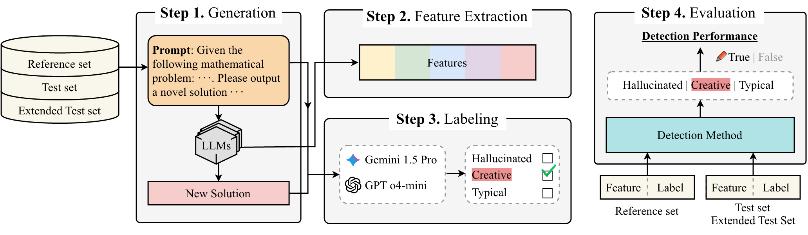
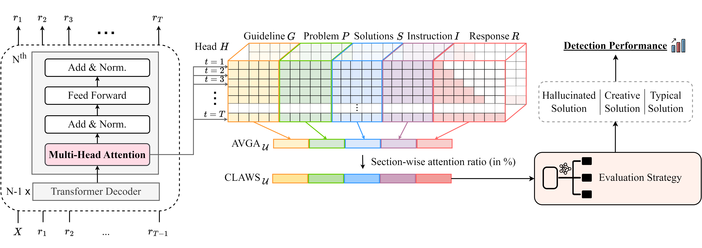

# [NeurIPS 2025] CLAWS:Creativity detection for LLM-generated solutions using Attention Window of Sections
> #### Keuntae Kim*, Eunhye Jeong*, Sehyeon Lee, Seohee Yoon, Yong Suk Choi†
> \*: Equal contribution, †: Corresponding author

<details>
  <summary><h2>Abstract</h2></summary>
  <div markdown="1">
    Recent advances in enhancing the reasoning ability of Large Language Models (LLMs) have been remarkably successful. LLMs trained with Reinforcement Learning (RL) for reasoning demonstrate strong performance in challenging tasks such as mathematics and coding, even with relatively small model sizes. However, despite these impressive improvements in task accuracy, the assessment of creativity in LLM generations has been largely overlooked in reasoning tasks, in contrast to writing tasks. The lack of research on creativity assessment in reasoning primarily stems from two challenges: (1) the difficulty of defining the range of creativity, and (2) the necessity of human evaluation in the assessment process. To address these challenges, we propose CLAWS, a novel method that defines and classifies mathematical solutions into Typical, Creative, and Hallucinated categories without human evaluation, by leveraging attention weights across prompt sections and output. CLAWS outperforms five existing white-box detection methods—Perplexity, Logit Entropy, Window Entropy, Hidden Score, and Attention Score—on five 7–8B math RL models (DeepSeek, Qwen, Mathstral, OpenMath2, and Oreal). We validate CLAWS on 4,545 math problems collected from 181 math contests (A(J)HSME, AMC, AIME).
  </div>
</details>


## Overview

**Step 1:** LLM generates a solution. \
**Step 2:** Features are extracted during generation. \
**Step 3:** LLM Evaluator assigns labels (Hallucinated / Creative / Typical). \
**Step 4:** Detection methods are evaluated by comparing predictions with the labels.
### CLAWS

All tokens are segmented into five sections: Guideline, Problem, Solutions, Instruction, and Response. 
The average attention weight for each section $${\mathrm{AVGA_{\mathcal{u}}}}$$ is computed, normalized to obtain section-wise attention ratios $$\mathrm{CLAWS_\mathcal{u}}$$, and used as features for detecting Hallucinated, Creative, or Typical solutions.

## ⚙️ Requirements
To install requirements:
```
pip install -r requirements.txt
```

## 💻 Running CLAWS
- dataset_name: REF / TEST / AMC / AIME / AHSME
### Step 1. Generation & Step 2. Feature Extraction
```
python src/generation_and_feature_extraction.py --model_name "generation_model_name" --n_generation 20 --dataset_name REF
python src/generation_and_feature_extraction.py --model_name "generation_model_name" --n_generation 3 --dataset_name TEST
```
### Step 3. Labeling
```
python src/labeling.py --generation_model_name "generation_model_name" --dataset_name REF
python src/labeling.py --generation_model_name "generation_model_name" --dataset_name TEST
```
### Step 4. Evaluation
```
python src/evaluation_strategy/MLP.py --model_name "generation_model_name" --dataset_name TEST
python src/evaluation_strategy/TabM.py --model_name "generation_model_name" --dataset_name TEST
python src/evaluation_strategy/prototype.py --model_name "generation_model_name" --dataset_name TEST
python src/evaluation_strategy/XGBoost.py --model_name "generation_model_name" --dataset_name TEST
```

## 📚 Citation
```
@misc{kim2025clawscreativitydetection,
      title={CLAWS:Creativity detection for LLM-generated solutions using Attention Window of Sections}, 
      author={Keuntae Kim and Eunhye Jeong and Sehyeon Lee and Seohee Yoon and Yong Suk Choi},
      year={2025},
      eprint={2510.17921},
      archivePrefix={arXiv},
      primaryClass={cs.CL},
      url={https://arxiv.org/abs/2510.17921}, 
}
```
